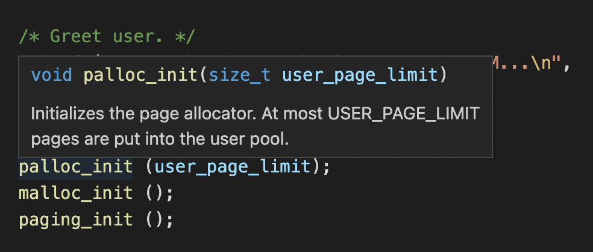

# Development Tools


Here are some tools that you might find useful while developing code, especially in a large codebase like Pintos.


## 1. ripgrep(rg)

Sometimes it is helpful to **find where is a specific function or variable declared or referenced in your project**.&#x20;

The Linux command line utility **`grep`** may satisfy your needs but there is **an extended version** [**ripgrep**](https://github.com/BurntSushi/ripgrep) which runs much faster and has more powerful options.&#x20;

`ripgrep` has first class support on Windows, macOS and Linux and helps me a lot during my development.

## 2. VSCode

**Although not required, TAs highly recommend you write Pintos projects in a modern IDE or a powerful text editor with pluggins supported**, e.g. VSCode.&#x20;

* In VSCode, you can see the function prototype and its description with the cursor hanging over the function name (like the picture below).

* Additionally, if you hold the `Command` key and click on the function name, you can jump right to its implementation. These small utilities may greatly increase your development efficiency.

## 3. Git

<mark style="color:red;">**It's crucial that you use a source code control system to manage your Pintos code.**</mark>** ** This will allow you to keep track of your changes. For this class we recommend that you use Git. If you don't already know how to use Git, we recommend that you read the [Pro Git](http://git-scm.com/book) book online.

## 4. Think tenth, code once

Other than the technical tools mentioned above, **a careful and elegant design before writing code is very, very, very important**. It will save you tons of time to write and debug your code. Your TAs spent several days designing all the data structures and their interfaces before the coding and the results proved that it is worthwhile.
